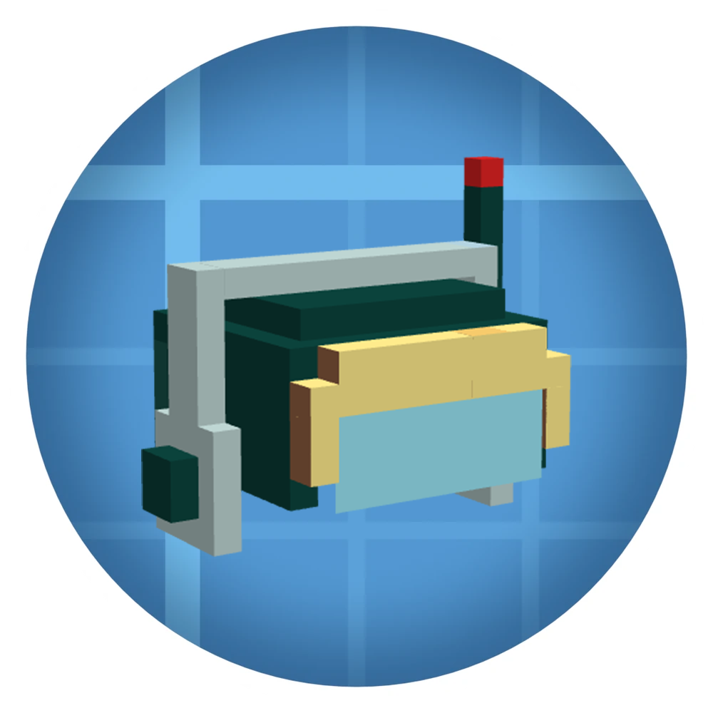

# Factory HUD Goggles

<p align="center">
  
</p>

<p align="center">
  <a href="https://github.com/z33awa/Factory-HUD-Goggles/actions/workflows/test-build.yml"></a>
  <a href="https://github.com/z33awa/Factory-HUD-Goggles/releases"></a>
  
  
  
  <a href="LICENSE"></a>
</p>

Factory HUD Goggles turns Create's temporary engineer-goggle tooltips into a
persistent, movable factory dashboard. Each pair of goggles owns its bindings,
layout and display settings, so the complete dashboard follows the item rather
than the player.

English · [简体中文](#简体中文)

## Features

- Bind an unlimited number of blocks to each individual pair of goggles.
- Find the goggles in their dedicated Factory HUD creative tab.
- Display Create goggle information as persistent HUD cards.
- Retain Create's normal engineer-goggle overlay for blocks that have not been
  pinned to the dashboard.
- Drag cards anywhere on screen in a transparent layout editor.
- Add a note below each card to identify its purpose.
- Resize cards from 50% to 200%.
- Adjust card background opacity from 20% to 100%.
- Automatically dim cards whose source is destroyed, unloaded, in another
  dimension, or otherwise unavailable.
- Highlight a bound block and its matching card with a green border when it is
  under the crosshair.
- Store all bindings and settings on the goggles ItemStack.
- Preserve and migrate data written by older versions.
- Avoid force-loading chunks.
- Render a custom head-worn 3D goggles model.

## Requirements

- Minecraft 1.21.1
- NeoForge 21.1.219 or newer
- Create 6.0.10 or newer
- Java 21 when building from source

Install the mod on both the client and server.

## Installation

1. Install NeoForge for Minecraft 1.21.1.
2. Install Create 6.0.10 or newer.
3. Download Factory HUD Goggles from
   [GitHub Releases](https://github.com/z33awa/Factory-HUD-Goggles/releases).
4. Put the JAR in the `mods` folder on both the client and server.

## Crafting

The goggles are a mid-game upgrade built around Create display technology:

```text
Brass Ingot   Electron Tube    Brass Ingot
Redstone      Create Goggles   Redstone
              Display Link
```

Obtaining a Display Link unlocks the recipe in the survival recipe book.

## Usage

1. Hold a pair of Factory HUD Goggles and Shift + right-click a block twice
   within five seconds to bind it.
2. Shift + right-click the same block twice to remove that binding. A normal
   right-click remains available for block GUIs and other interactions.
3. Wear the goggles to display their dashboard.
4. In any inventory or container, hover the goggles and press Create/Ponder's
   configured ponder key (`W` by default) to open the layout editor.
5. Drag a card with the left mouse button to move it.
6. Right-click a card to edit its note.
7. Shift + right-click a card to delete its binding, including an unavailable
   or destroyed source.
8. Scroll over a card to resize it. Hold Shift while scrolling to adjust its
   background opacity.
9. Use the settings button in the top-right corner to configure automatic
   dimming for unavailable cards.

## Data and save compatibility

- The goggles data uses an explicit schema version.
- Older data is upgraded through additive migrations.
- The original data is backed up inside the ItemStack before its first upgraded
  write.
- Corrupt individual bindings are skipped instead of invalidating the entire
  pair of goggles.
- Unknown binding fields are retained during ordinary saves.
- Data from a newer mod version is opened read-only, preventing an older version
  from damaging it.

## Building from source

Clone the repository and run the Gradle wrapper with Java 21:

```bash
./gradlew build
```

On Windows:

```powershell
.\gradlew.bat build
```

The output JAR is written to `build/libs`. The normal `build` task also runs the
standalone HUD data migration regression tests.

## License

Released under the [MIT License](LICENSE). Copyright © 2026 z33awa.

---

## 简体中文

**工厂仪表护目镜**可以把机械动力工程师护目镜原本临时显示的信息固定成持续显示、
可自由布局的 HUD 仪表盘。数据源、卡片位置和显示设置全部保存在护目镜物品中，
而不是保存在玩家身上；把护目镜交给其他玩家时，整套仪表盘也会一起转移。

### 功能

- 每副护目镜可以绑定任意数量的数据源。
- 可在独立的“工厂仪表盘”创造模式分页中找到护目镜。
- 将机械动力护目镜信息持续显示为独立卡片。
- 完整保留机械动力工程师护目镜功能，可临时查看尚未固定到仪表盘的方块信息。
- 在透明编辑界面中直接拖动卡片。
- 为每张卡片添加用途备注。
- 卡片大小可以在 50%–200% 之间调整。
- 卡片背景透明度可以在 20%–100% 之间调整。
- 数据源被破坏、区块卸载、位于其他维度或暂不可用时，可以自动降低对应卡片透明度。
- 准星指向已绑定方块时，方块和对应卡片会同时显示绿色边框。
- 所有绑定、布局和设置均保存在护目镜物品中。
- 自动迁移旧版本数据，并保护来自更高版本的数据。
- 不会强制加载数据源所在区块。
- 包含自定义头戴 3D 护目镜模型。

### 运行需求

- Minecraft 1.21.1
- NeoForge 21.1.219 或更高版本
- Create 6.0.10 或更高版本

客户端和服务端都需要安装本模组。

### 安装

1. 安装 Minecraft 1.21.1 对应的 NeoForge。
2. 安装 Create 6.0.10 或更高版本。
3. 从 [GitHub Releases](https://github.com/z33awa/Factory-HUD-Goggles/releases)
   下载本模组。
4. 将 JAR 放入客户端和服务端的 `mods` 文件夹。

### 使用方法

1. 手持工厂仪表护目镜，在五秒内对同一方块 Shift + 右键两次，将其绑定到当前这副护目镜。
2. 对同一方块再次执行两次 Shift + 右键即可解除绑定；普通右键仍会正常打开方块 GUI 或执行原有交互。
3. 戴上护目镜后，仪表盘会持续显示。
4. 在玩家物品栏、装备栏、箱子或其他容器中，将鼠标悬停在护目镜上并按机械动力
   “思索”按键（默认 `W`），打开布局编辑器。
5. 左键拖动卡片；右键编辑备注；Shift + 右键删除绑定。
6. 在卡片上滚动滚轮调整大小；按住 Shift 滚动调整背景透明度。
7. 使用右上角设置按钮配置不可用卡片的自动淡化。

### 合成配方

工厂仪表护目镜是一件使用机械动力显示技术制作的中期升级装备：

```text
黄铜锭        电子管        黄铜锭
红石          工程师护目镜  红石
              显示链接器
```

生存模式中获得显示链接器后，会自动在配方书中解锁该配方。

### 存档兼容

- 护目镜数据包含明确的结构版本。
- 旧数据通过逐级迁移升级，缺失字段会补充安全默认值。
- 第一次升级写入前会在物品内部保存一份原始数据备份。
- 单条损坏的绑定会被跳过，不会导致整副护目镜失效。
- 普通保存时会保留无法识别的绑定字段。
- 更高版本写入的数据会以只读方式打开，防止旧版本覆盖未知字段。

### 从源码构建

项目使用 Java 21 和 Gradle Wrapper：

```powershell
.\gradlew.bat build
```

构建产物位于 `build/libs`，完整构建同时执行 HUD 数据迁移回归测试。

### 许可

本项目采用 [MIT 许可证](LICENSE)。Copyright © 2026 z33awa。
